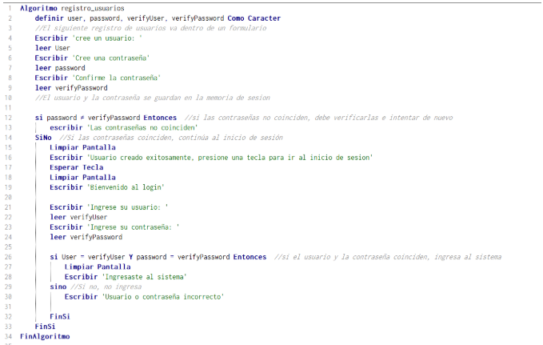

<!-- 🌈 BANNER INICIAL -->

  

# 🚀 Beacoder_app  
**Código para una app ejemplo de estudiantes en Riwi**

---

## 📌 Bloque 1 – Requisitos (10 min)

👤 **Responsable:** Felipe Hincapié Murillo (Product Owner)  
🎯 **Solución digital:** Plataforma interactiva que **gamifica el proceso de aprendizaje**

🧩 **Problema que resuelve:**  
> Volver el proceso de aprendizaje más dinámico y atractivo mediante la gamificación.

👥 **Público objetivo:** Coders de Riwi

✨ **3 funcionalidades clave:**

- 🔐 **Sistema de login:** Registro e inicio de sesión de usuarios  
- 🗺️ **Ruta de aprendizaje interactiva:** Se desbloquea progresivamente (tipo Duolingo)  
- 🏆 **Tabla de puntajes:** Ranking visible con puntuaciones de todos los usuarios

---

## 🔍 Bloque 2 – Análisis (10 min)

👤 **Responsable:** Brayan (Analista)

📌 **Tareas clave:**

### 🔐 Login / Usuario
- Crear formulario de registro  
- Opción de personalizar perfil  
🟢 **Dificultad:** baja  
🚫 **Restricciones:**
  - Solo coders de Riwi con código de usuario pueden acceder  
  - No se aceptan nombres ni fotos de perfil inapropiados

---

### 🗺️ Ruta de aprendizaje interactiva
- Crear funcionalidad de niveles  
- Comparativa de respuestas para avanzar  
- Desbloqueo progresivo de nuevas funciones  
🔴 **Dificultad:** alta  
🚫 **Restricciones:**
  - Si no responde correctamente, no avanza al siguiente nivel

---

### 🏆 Tabla de puntajes
- Asignar puntos según progreso  
- Mostrar ranking general  
🟠 **Dificultad:** media  
🚫 **Restricciones:**
  - El puntaje debe ser justo y acorde al nivel  
  - El usuario no puede manipular la tabla

---

## 🎨 Bloque 3 – Diseño (10 min)

👤 **Responsable:** Alejandra (Diseñadora UX/UI)

🖼️ **Entregables de diseño:**

- 

  <a href="https://github.com/Felipehincacode/Beacoder_app/blob/main/Be%20a%20coder_Final.pdf" target="_blank">
    Link al pdf
  </a>

- 🔄 Diagrama simple del flujo de usuario

---

## 💻 Bloque 4 – Implementación (15 min)

👤 **Responsable:** Santiago (Desarrollador)

🛠️ **Feature implementada:** Registro de usuarios

📖 **Descripción:**

> Se permitirá crear un usuario por medio de un formulario. Se pedirá nombre de usuario y contraseña (doble validación). Luego podrá iniciar sesión con validación de datos.

  

---
## 🧪 Bloque 5 – Pruebas (10 min)

👤 **Responsable:** Juan Pablo (QA Tester)

### ⚙️ **Casos funcionales:**

   - **Caso 1:** Cuando se inicia sesión, se muestra mi ruta de aprendizaje actual e indicadores de progresión actualizados.
   - **Caso 2:** En caso de no terminar la sesión de estudio o la prueba de aprendizaje ésta no se cuenta en el progreso ni tampoco, suma como puntaje en la tabla de posiciones.
   - **Caso 3:** Al revisar la tabla de clasificación se muestra en tiempo real mi posición y la de los demás users de la división ó categoría.

---

### ⁉️ **Posibles errores:**

   - Errores de sintaxis
   - Error al declarar variables
   - Problemas de optimización al ejecutar codigo en la plataforma
   - Error al actualizar información luego de realizar alguna actividad    
---

## 🚢 Bloque 6 – Despliegue y Mantenimiento (5 min)

👤 **Responsable:** Susana

📦 **Estrategia de despliegue:**

- 🚀 **Frontend:** Vercel o Firebase Hosting
- 🛠️ **Backend y Base de datos:** Servidor propio con MongoDB Atlas o Firebase Firestore. 
- 📲 **Almacenamiento de la app:** Stores tipo Google Play, App Store.

🛠️ **Mejoras futuras:**

1. 🎯 Funcionalidad de premios o logros desbloqueables que puedan ser compartidos en una sección tipo foro, en dónde otros coders puedan reaccionar y comentar para fomentar el apoyo y el aprendizaje colaborativo.
2. 🌐 Multilenguaje; Funcionalidad que permita cambiar el idioma de la interfaz (español <-> inglés), para que sea el coder quien decida en qué idioma hará su ruta de aprendizaje, lo cuál permitiría practicar vocabulario técnico y compresión lectora en inglés.

---

<!-- 🎬 BANNER FINAL -->

  

